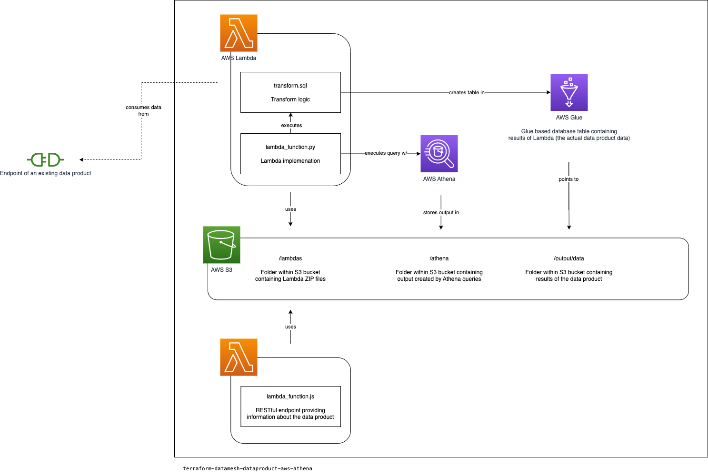

# terraform-dataproduct-aws-athena

This open source Terraform module provisions the necessary services to provide a data product on AWS.



## Services

* AWS S3
* AWS Athena
* AWS Glue
* AWS Lambda

## Usage

```hcl
module my_data_product {
  source = "git@github.com:datamesh-architecture/terraform-dataproduct-aws-athena.git"

  domain   = "<data_product_domain>"
  name     = "<data_product_name>"
  
  schedule = "0 0 * * ? *" # Run at 00:00 am (UTC) every day

  input = [
    {
      source = "<data_product_endpoint>"
    }
  ]

  transform = {
    query = "sql/<name_of_the_transform>.sql"
  }

  output = {
    format   = "<format>"
  }
}
```

## Endpoint data

The module creates an RESTful endpoint via AWS lambda (e.g. https://3jopsshxxc.execute-api.eu-central-1.amazonaws.com/prod/). This endpoint can be used as an input for another data product or to retrieve information about this data product.

```json
{
  "domain": "<data_product_domain>",
  "name": "<data_product_name>",
  "output": {
    "location": "arn:aws:s3:::<s3_bucket_name>/output/data/"
  }
}
```

## Examples

See [examples repository](https://github.com/datamesh-architecture/terraform-dataproduct-examples).

## Requirements

| Name                                                                      | Version    |
|---------------------------------------------------------------------------|------------|
| <a name="requirement_terraform"></a> [terraform](#requirement\_terraform) | >= 1.3.7   |
| <a name="requirement_aws"></a> [aws](#requirement\_aws)                   | >= 4.0     |

## Providers

| Name                                                                | Version   |
|---------------------------------------------------------------------|-----------|
| <a name="provider_aws"></a> [aws](#provider\_aws)                   | >= 4.0    |

## Authors

This terraform module is maintained by [Andre Deuerling](https://www.innoq.com/en/staff/andre-deuerling/), [Jochen Christ](https://www.innoq.com/en/staff/jochen-christ/), and [Simon Harrer](https://www.innoq.com/en/staff/dr-simon-harrer/).

## License

MIT License.
